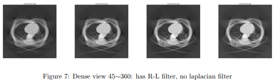
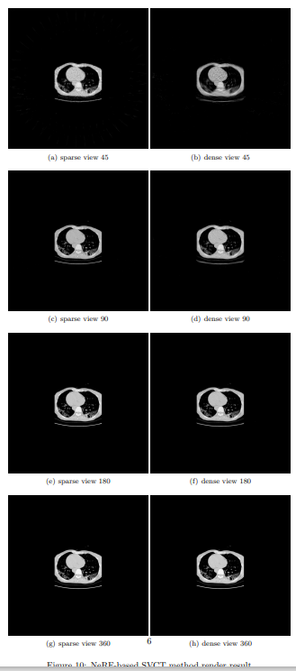

## NeRF for Sparse-view CT

​	In this programming assignment, we implement basic FBP algorithm by Matlab[Tra21] and NeRFbased method by Pytorch.

## Run

​	We implement data generator by matlab and reconstruct raw data by python.

### Matlab 

run script.m in Matlab

### Python
```bash
python main.py
```

## Results



